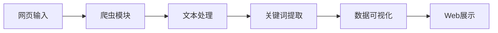

# Python 网络文本分析与可视化系统

基于 Python 的网络爬虫与数据可视化项目

<div class="pt-12">
  <span @click="$slidev.nav.next" class="px-2 py-1 rounded cursor-pointer" hover="bg-white bg-opacity-10">
    开始演示 <carbon:arrow-right class="inline"/>
  </span>
</div>

---

# 项目概述

本项目是一个基于 Python 的网络文本分析与可视化系统，主要功能包括：

<v-clicks>

- 🕷️ **网络爬虫** - 自动获取网页文本内容
- 🧹 **数据清洗** - 文本预处理与关键词提取
- 📊 **数据可视化** - 多种可视化图表展示
- 🌐 **Web 应用** - 交互式用户界面

</v-clicks>

<div class="mt-12">
主要技术栈：

<div class="grid grid-cols-4 gap-4 mt-4">
<v-clicks>

- Python
- Streamlit
- Requests
- BeautifulSoup4
- Jieba
- Pyecharts
- Matplotlib
- Plotly
- Seaborn
- Pandas

</v-clicks>
</div>
</div>

---

# 系统架构

<div class="grid grid-cols-2 gap-4">

<div>

## 前端部分
- Streamlit 框架
- 响应式布局
- 交互式组件
- 多种可视化图表

</div>

<div>

## 后端部分
- 网络爬虫模块
- 文本处理模块
- 数据分析模块
- 可视化引擎

</div>

</div>

<div class="mt-8">

## 核心功能模块


</div>

---

# 可视化功能展示

<div class="grid grid-cols-2 gap-4">

<div>

## 支持的图表类型

<v-clicks>

- 词云图
- 柱状图
- 饼图
- 折线图
- 散点图
- 漏斗图
- 雷达图

</v-clicks>

</div>

<div>

## 可视化库特点

<v-clicks>

- Pyecharts：交互性强，美观
- Matplotlib：灵活性高
- Plotly：现代化设计
- Seaborn：统计分析友好

</v-clicks>

</div>

</div>

---

# 核心代码展示

## 爬虫模块

```python {all|2-3|5-8|all}
def scrape_text(url):
    # 发送请求获取网页内容
    response = requests.get(url)
    
    # 使用 BeautifulSoup 解析网页
    soup = BeautifulSoup(response.text, 'html.parser')
    # 提取文本内容
    text = soup.get_text()
    return text
```

## 文本处理

```python {all|2-3|5-6|all}
def process_text(text):
    # 使用 jieba 分词
    words = jieba.cut(text)
    
    # 统计词频
    word_counts = Counter(words)
    return word_counts
```

---

# 项目特点

<v-clicks>

- 🚀 **高效性**：自动化的数据获取和处理流程
- 🎨 **多样性**：支持多种可视化方式
- 🔄 **交互性**：良好的用户交互体验
- 📱 **响应式**：适配不同设备的显示
- 🛠️ **可扩展**：模块化设计，易于扩展
- 🎯 **实用性**：解决实际文本分析需求

</v-clicks>

---

# 项目展望

<div class="grid grid-cols-2 gap-4">

<div>

## 功能扩展

<v-clicks>

- 支持更多数据源
- 增加数据分析功能
- 优化可视化效果
- 提升处理性能

</v-clicks>

</div>

<div>

## 应用场景

<v-clicks>

- 舆情分析
- 文本挖掘
- 内容分析
- 数据报告

</v-clicks>

</div>

</div>

---
layout: center
class: text-center
---

# 感谢观看

[项目文档](https://github.com/yourusername/project) · [在线演示](https://your-demo-url.com)
